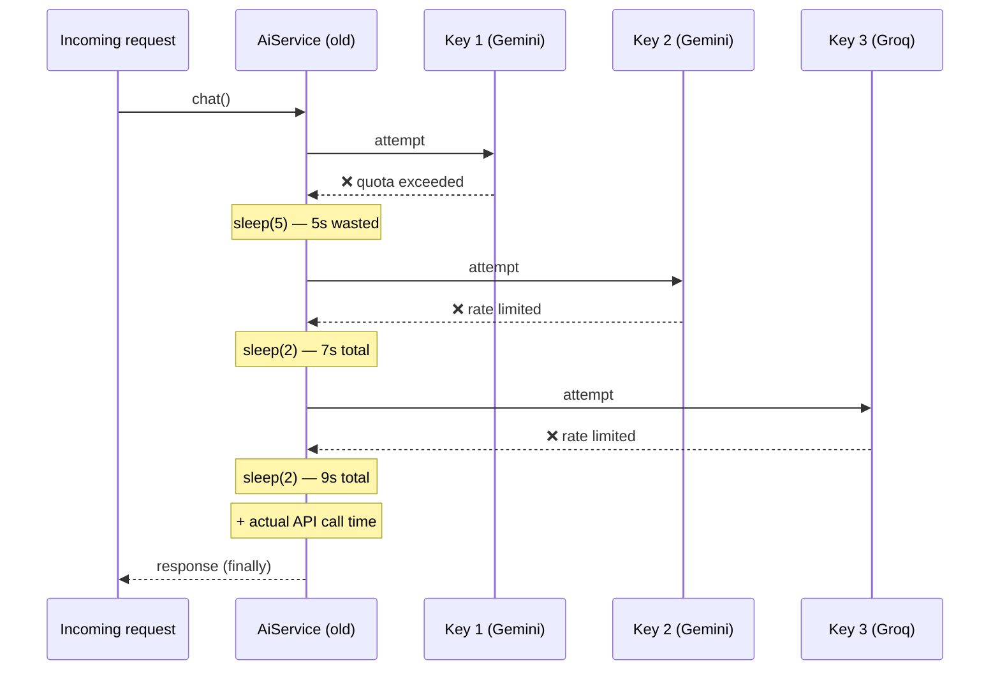
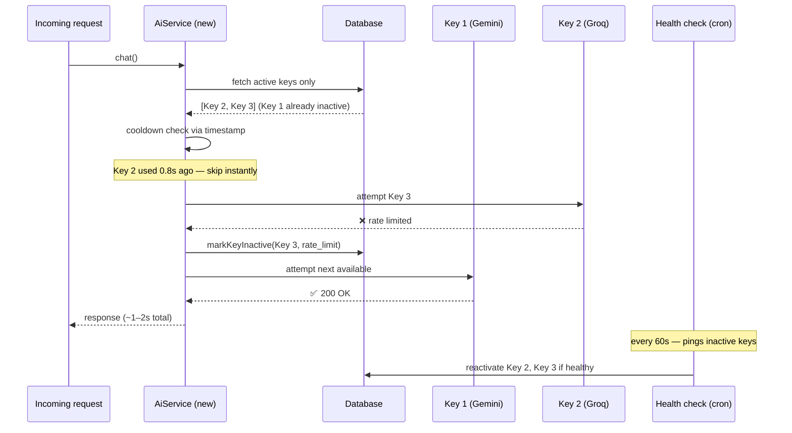

I keep a file called `AiService.copy.php` in my codebase. Not because I need it. Not because I plan to use it again. I keep it as a reminder of what happens when you solve a problem with the wrong tool.

That file represents a version of my system that made users wait 17 seconds for an AI reply. This is the story of what went wrong, what the code actually looked like, and what I changed to get median latency down to 1 to 2 seconds, without touching the server, switching providers, or paying a cent more.

## The Context

ORCA is a multi-tenant WhatsApp AI customer service platform I built and run solo. It sits on a VPS and handles real property sales conversations across multiple tenants. The AI layer rotates across multiple free-tier API keys from providers like Gemini, Groq, Cerebras, and OpenRouter.

The core idea is simple: when a customer messages on WhatsApp, ORCA processes it, calls an AI provider, and replies. Multi-key rotation exists because each free-tier key has a rate limit. Hit the limit on one key, move to the next.

On paper, it sounds fine. In production, it was a disaster.

## The Code That Caused the Problem

Here is the actual rotation logic from the old `AiService.php`, preserved intact:

```php
foreach ($keys as $key) {
    $attempt++;

    try {
        // If this is not the first attempt (meaning the previous key failed),
        // add a short delay so the server does not treat it as brute-force/spam.
        if ($attempt > 1) {
            sleep(2);
        }

        $response = $this->callProvider($key, $model, $systemPrompt, $messages);
        return $response;

    } catch (\Exception $e) {
        $errorMsg = $e->getMessage();

        // SPECIAL CASE: if we hit "High Demand" or "Quota Exceeded",
        // wait longer (5 seconds) before moving to the next key.
        if (
            stripos($errorMsg, "high demand") !== false ||
            stripos($errorMsg, "quota") !== false
        ) {
            sleep(5);
        }

        continue;
    }
}
```

Read that again. Every failed key attempt triggers a `sleep()`. The first failure costs 2 seconds. A quota error costs 5 seconds. With four keys across two providers, a bad rotation sequence could stack like this:

- Key 1 fails (quota): `sleep(5)` — 5 seconds
- Key 2 fails (attempt > 1): `sleep(2)` — 7 seconds total
- Key 3 fails (attempt > 1): `sleep(2)` — 9 seconds total
- Key 4 fails (attempt > 1): `sleep(2)` — 11 seconds total
- Finally succeeds, plus actual API call time

That is where the 17 seconds came from. Not network latency. Not a slow model. A loop with `sleep()` calls stacked on top of each other.



The reasoning behind those sleeps was not irrational. The developer (me, six months ago) was trying to be polite to the APIs. Do not hammer a provider that just said it was rate limited. Give it a breath. It made sense as a local optimization while completely ignoring the cost paid by the person waiting for a reply.

## The Real Problem: State Without Memory

Beyond the sleep calls, there was a deeper structural issue. The old service had no persistent memory of which keys were healthy or unhealthy. Every incoming request would query for active keys and iterate through them from scratch. If a key was rate-limited five minutes ago, the service had no way of knowing that unless it tried again and hit the same error.

This meant the same failed key would be attempted on every single request until it accidentally succeeded, or until a human noticed the logs and manually deactivated it.

The service was doing the same work over and over, paying the same latency penalty each time, learning nothing.

## What the New Architecture Does Differently

The new `AiService.php` makes two structural changes that eliminate the latency problem entirely.

### No sleep(), Ever

The new rotation logic skips keys based on a timestamp comparison, not a blocking wait:

```php
if ($cooldownSeconds > 0 && !empty($key["last_used_at"])) {
    $secondsSinceUsed = time() - strtotime($key["last_used_at"]);
    if ($secondsSinceUsed < $cooldownSeconds) {
        $skippedKeys[] = $key;
        continue; // move on immediately, no waiting
    }
}
```

If a key was used recently, skip it and try the next one. No blocking. No waiting. The request keeps moving. The cooldown window still exists, but it is enforced by checking a timestamp rather than making the current request sit in a queue.

### Circuit Breaker With Persistent State

When a key fails with a rate limit or quota error, it is now marked inactive in the database immediately:

```php
private function markKeyInactive(int $keyId, string $reason, string $errorMsg): void
{
    $this->apiKeyModel->update($keyId, [
        'is_active' => 0,
        'inactive_reason' => $reason,
        'deactivated_at' => date('Y-m-d H:i:s'),
        'last_error_at' => date('Y-m-d H:i:s'),
        'last_error_msg' => mb_substr($errorMsg, 0, 255),
    ]);

    $cbLogModel = new \App\Models\CircuitBreakerLogModel();
    $cbLogModel->insert([
        'key_id'     => $keyId,
        'provider'   => $keyRow['provider'],
        'key_label'  => $keyRow['label'],
        'reason'     => $reason,
        'tripped_at' => date('Y-m-d H:i:s'),
    ]);
}
```

The next request never sees that key in the active pool. No retrying a key that was rate-limited 30 seconds ago. No paying the latency cost of a predictable failure.



### Health Check as a Background Job

Deactivated keys come back to life through a scheduled command that runs independently of the request cycle:

```php
// ApiKeyHealthCheckCommand.php — runs via cron every minute
// Sends a real "hi" ping to each inactive key
// Reactivates it if the response is HTTP 200
// Stamps recovered_at in the circuit breaker log if successful
```

This decouples recovery from request handling. The user's conversation is never delayed by a key that is trying to heal itself.

## The Two-Pass Design for Edge Cases

The new service also handles an edge case gracefully: what happens when all available keys are currently in their cooldown window?

Rather than throwing an error immediately, it collects the skipped keys in a `$skippedKeys` array and runs a second pass after the first loop completes:

```php
// Pass 2: try keys that were skipped due to cooldown
// This only runs if every key in pass 1 was skipped
foreach ($skippedKeys as $key) {
    // same rotation logic, no sleep()
}
```

In practice this almost never triggers, because with multiple keys across multiple providers there is almost always something available. But when it does, the request still completes. It just uses a slightly warmer key.

## The Numbers

The change in median latency from 17 seconds to 1 to 2 seconds came entirely from removing the `sleep()` calls and adding persistent circuit breaker state. Nothing else changed. Same server. Same providers. Same free-tier keys.

The 17 seconds were not caused by slow AI models or an overloaded server. They were manufactured by the rotation code itself. The system was waiting for no reason.

## What the File Teaches

I keep `AiService.copy.php` in the repository for the same reason some teams keep post-mortem documents: not to feel bad about the past, but to have a concrete reference for what a bad pattern looks like in real code, in a real production system that was handling real customer conversations.

The pattern to remember is this: when you introduce latency as a mechanism to handle failure (sleep before retry, wait before the next attempt), you are making every request pay the cost of the worst-case failure path. A system that waits 5 seconds when a key is rate-limited will eventually serve a user who waits 5 seconds, even when most keys are healthy.

State belongs in the database. Recovery belongs in a background job. The request path should only ever do work, never wait.

---

The circuit breaker implementation described here is also available as a standalone PHP package: [octopus-llm/php](https://packagist.org/packages/octopus-llm/php), a framework-agnostic AI gateway with multi-key rotation and provider fallback. A Laravel wrapper is also available at `octopus-llm/laravel` with Redis-backed state for horizontal scaling.
